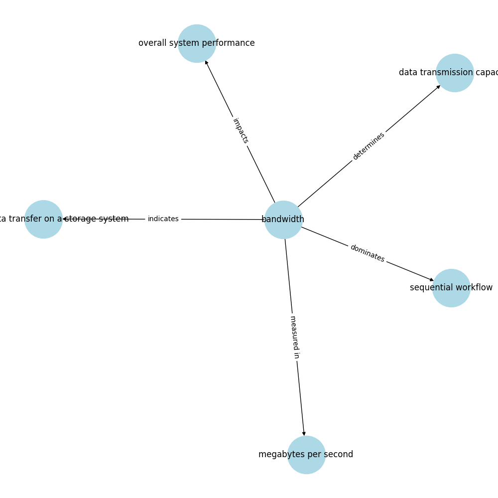
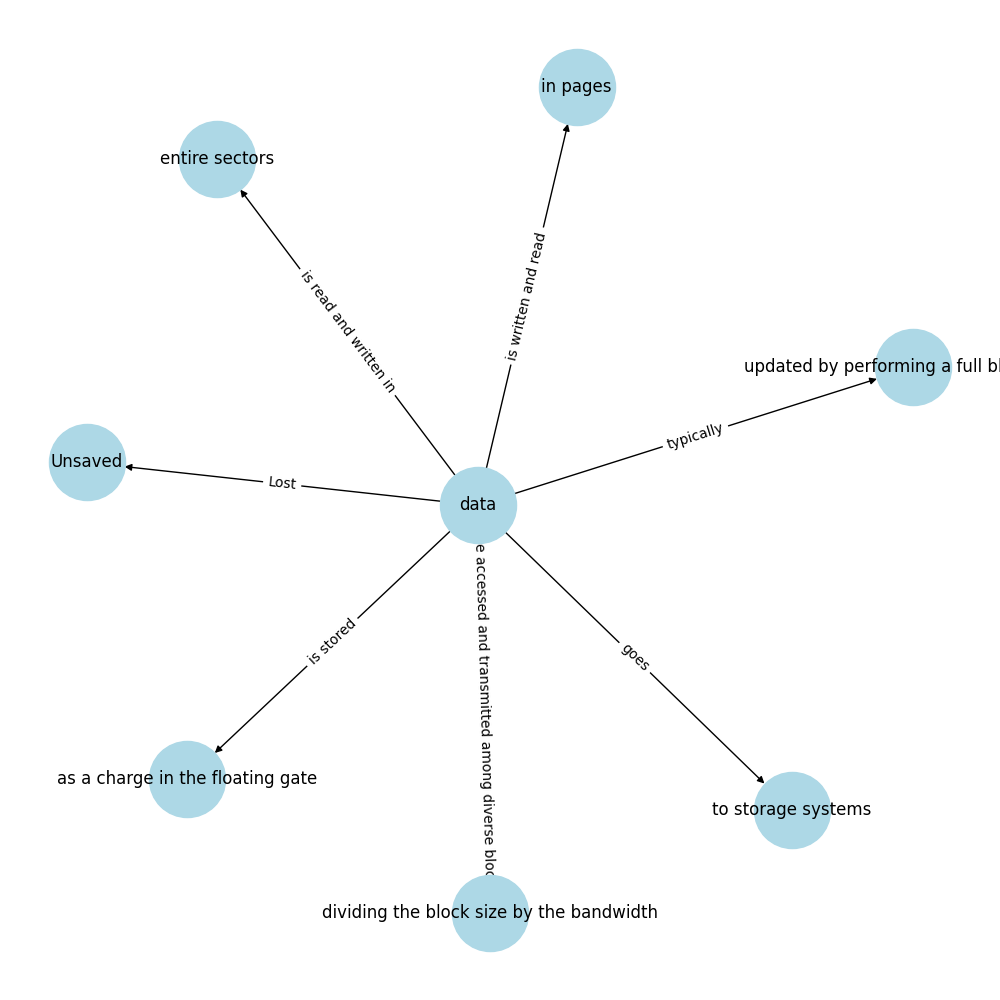
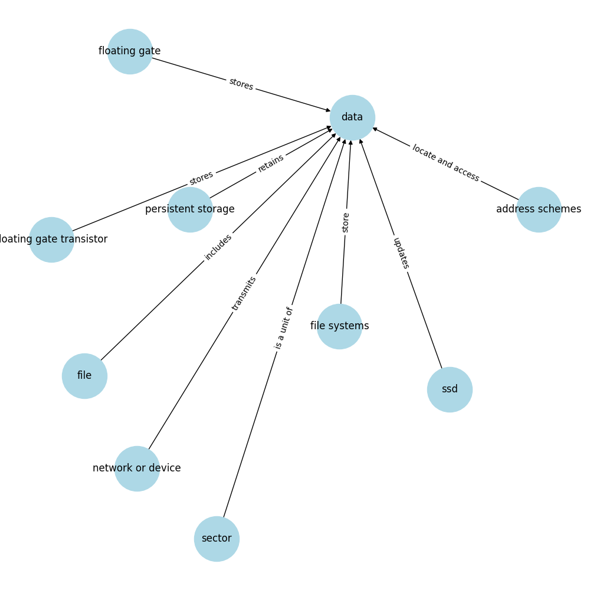
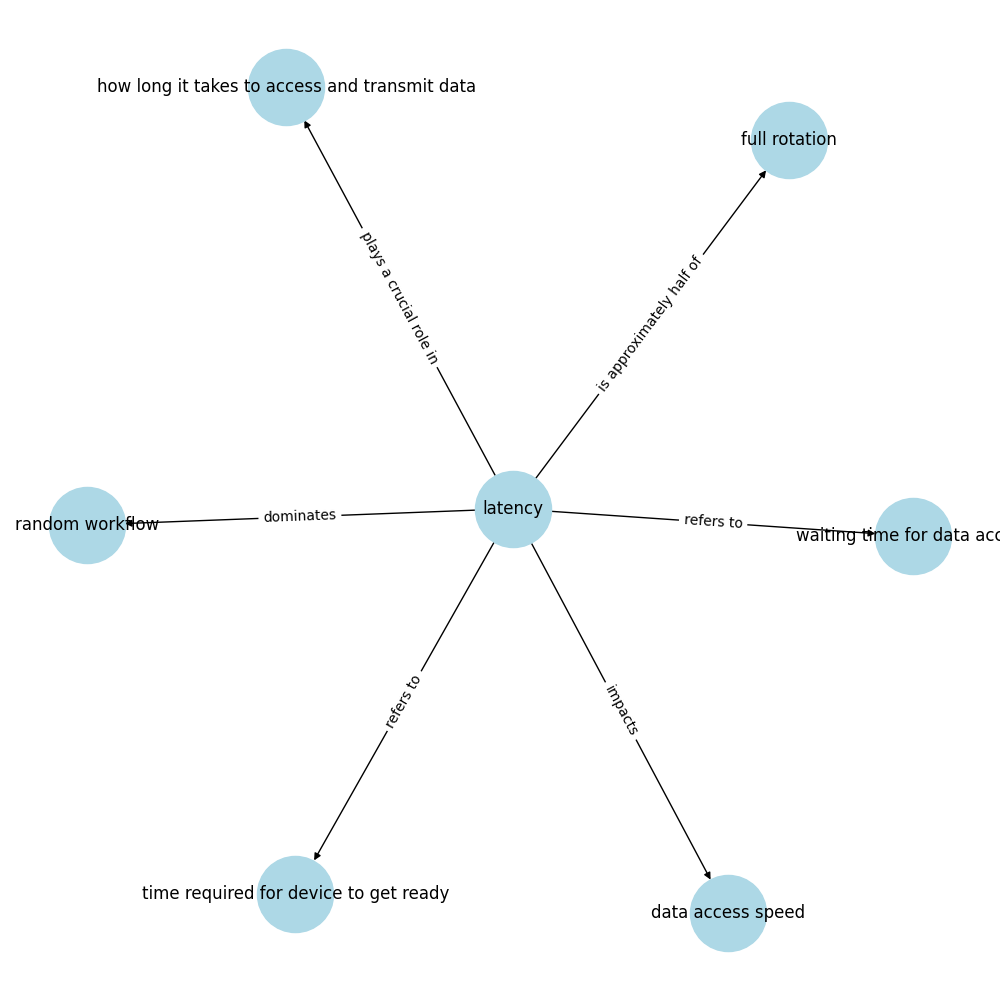
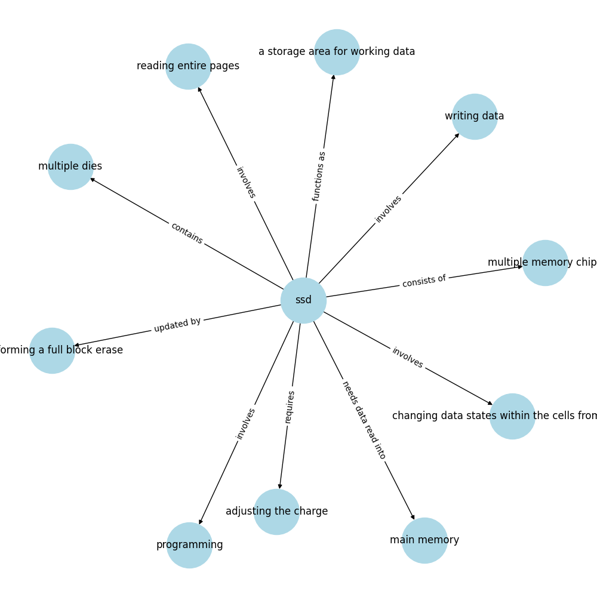

# EduSummarise
A solution that helps students to quickly go through the lecture and understand the key points by gerating notes and mind maps from the lecture transcripts.

## Create notes from transcripts
You can run the following command to create notes from :
```bash
python notesCreator.py
```
, this will create from transcripts in [transcript.txt](./transcript.txt) notes stored in [generated-notes.txt](./generated-notes.txt) file.

## Create mindmaps from notes
You can run the following command to create a mindmap from a note file:
```bash
python mindmapCreator.py -i "generated-notes.txt" -t "Lecture 3: File systems" -c "Foundational data management" -mt 3 -th 4 -o "generated-relations.txt" -mf "mindmaps"
```
where:
- `-i`  : the file containing the notes to extract relations from (relations, or triples, are of the form `"<subject> - <predicate> - <object>"`)
- `-t`  : the title of the lecture
- `-c`  : the name of the class
- `-mt` : the maximum number of triples per note to extract
- `-th` : the threshold for the frequency of entities to keep in the extracted triples
- `-o`  : the file to write the extracted triples to
- `-mf` : the folder to save the generated mindmaps

<!-- add figures from ./mindmaps/ -->
Sample generated mind maps for a lecture on **File system** for the class **Foundational data management** at USC are shown below:
- 
- 
- 
- 
- 
- 
- 
